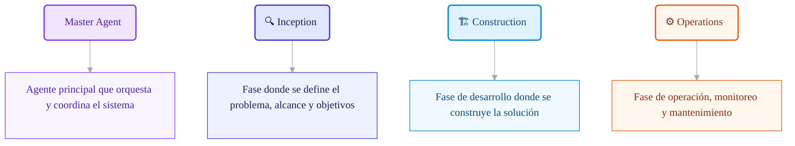
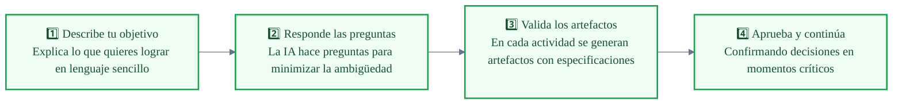
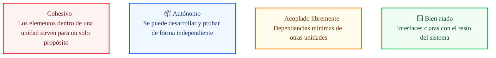

# 🚀 Runbook: Ejecución del Framework AI-DLC con Claude + Cursor

---

## 📋 Índice

1. [Descarga e inicialización del repositorio](#paso-1)
2. [Inicio del framework](#paso-2)
3. [Fases de la metodología AI-DLC](#fases)
4. [Cocreación con AI-DLC | Inception](#paso-3)

---

## Paso 1: Descarga del framework AI-DLC e inicialización del repositorio

> 🔗 **Repositorio oficial:** [aidlc-workflow](https://github.com/awslabs/aidlc-workflows?tab=readme-ov-file#usage)
> 📦 **Versión:** [Descargar v0.1.5](https://github.com/awslabs/aidlc-workflows/releases/tag/v0.1.5)

Partimos de un espacio con el PRD y la carpeta con el framework e inicialización del repositorio.

```sh
cd /Users/cbraatz/workspace/SDD/ai-dlc
```

```sh
mkdir agentic_interviewer_ai
```

```sh
cd agentic_interviewer_ai
cp ../PRD_agentic_interviewer_ai.md PRD_agentic_interviewer_ai.md
cp ../aidlc-rules/aws-aidlc-rules/core-workflow.md ./CLAUDE.md
mkdir -p .aidlc-rule-details
cp -R ../aidlc-rules/aws-aidlc-rule-details/* .aidlc-rule-details/
```

```sh
cursor .
```

---

## Paso 2: Inicio del framework

> **💬 PROMPT / CONTEXTO**
>
> **Usando AI-DLC**, construiremos un producto que consiste en una plataforma de entrevistas agénticas que conduce screenings conversacionales inteligentes vía Telegram para empresas de alto volumen en América Latina, reemplazando chatbots de reglas estáticas con un agente que razona, repregunta y entrega evidencia estructurada al reclutador humano; con base en el Product Requirements Document (PRD) `@PRD_agentic_interviewer_ai.md`.

---

## Fases de la metodología AI-DLC



---

## Intenciones: pasos



---

## Paso 3: Cocreación con AI-DLC Framework | Inception

> 🎯 **Objetivo:** Definir la "Única Fuente de Verdad" antes de codificar.
>
> Captura intenciones, elabora requisitos y desglosa el trabajo en unidades manejables.

### 📁 Tipo de artefactos

A continuación se describen las actividades y artefactos generados durante la fase inicial del ciclo de vida de desarrollo impulsado por IA (AI-DLC).

| Actividad | Tipo de Artefacto | Descripción (AI-DLC) |
| :--- | :--- | :--- |
| **Workspace Detection** | `workspace-detection.md` | Análisis del entorno técnico para dar contexto base a la IA sobre dependencias. |
| **Requirements Analysis** | `requirements-analysis.md` | Refinamiento de necesidades mediante prompts, eliminando ambigüedades técnicas. |
| **User Stories** | `user-stories.md` | Criterios estructurados, optimizados para instrucciones de generación de código. |
| **Workflow Planning** | `workflow-planning.md` | Orquestación de tareas y validación humana (Human-in-the-loop). |
| **Application Design** | `application-design.md` | Blueprint de arquitectura para asegurar coherencia en la generación masiva. |
| **Units Generation** | `units-generation.md` | Creación de componentes atómicos con prompts y pruebas unitarias. |

---

A continuación se detallan las actividades, el proceso de desarrollo de cada una y un ejemplo como muestra de los artefactos generados durante la cocreación a partir del framework para el producto guía de curso **EntreVista AI** (plataforma de entrevistas agénticas que conduce screenings conversacionales inteligentes).

---

### 🔎 PHASE 00 — Workspace Detection

**Project Information**

| Campo | Valor |
| :--- | :--- |
| **Project Name** | `Agentic Interviewer AI` |
| **Project Type** | Greenfield |
| **Start Date** | `2026-03-09` |
| **Current Stage** | `INCEPTION` → `Requirements Analysis` |

**Workspace State**

- **Existing Code:** No
- **Reverse Engineering:** No
- **Root:** `.../ai-dlc/agentic_interviewer_ai_v2`

> **📌 Code Location Rules**
>
> - **Application Code:** Workspace root
> - **Documentation:** Solo en `aidlc-docs/`
> - **Structure Patterns:** Ver `code-generation.md` Critical Rules

---

### 📝 PHASE 01 — Requirements Analysis

**Usuarios del Sistema**

| Actor | Descripción | Acceso |
| :--- | :--- | :--- |
| **Candidato** | Persona que será entrevistada. No necesita cuenta. Accede vía link único. | Link único por entrevista |
| **Reclutador** | Persona en la startup que configura entrevistas, envía links y revisa resultados. | Cuenta con credenciales en plataforma |

> ⚠️ **Nota:** Administrador y Hiring Manager están *fuera del alcance (Out of Scope)* para este MVP.

**Functional Requirements**
> **Propósito:** Qué hace el sistema.

- [x] Core Agental Reasoning
- [x] Telegram API Integration

**Non-Functional Requirements**
> **Propósito:** Cómo se comporta el sistema.

- [x] Response Latency < 2s
- [ ] 99.5% Availability

**Success Criteria (MVP)**

- [x] Conversación fluida completada
- [x] Notificación al Reclutador

---

### 🧑‍💼 PHASE 02 — User Stories

#### Personas

**Valentina** — User Persona
> Representación semi-ficticia enfocada en necesidades psicológicas y laborales. Las historias de usuario se derivan de sus "pain points" específicos.

#### Backlog de historias y Escenarios con criterios de aceptación en lenguaje Gherkin

- **Feature-Based Grouping:** Historias organizadas por capacidades del agente.
- **Validation:** Escenarios `Given / When / Then` listos para ser transformados en Unit Tests.

---

### 🗺️ PHASE 03 — Workflow Planning

> **Strategy:** Definición táctica del plan de ejecución para alimentar el *Application Design*. Se establece el mecanismo para la definición de componentes, servicios y la estrategia de construcción de estos.

---

### 🏛️ PHASE 04 — Application Design

| Capa | Responsabilidad | Archivo |
| :--- | :--- | :--- |
| **Componentes** | Definición de estilo arquitectónico y capas. | `components.md` |
| **Servicios** | Definiciones preliminares relacionadas con lógica de negocio y métodos core. | `services.md` |
| **Dependencias** | Dependencias entre componentes y patrón de resolución. | `component-dependency.md` |

---

### 🧩 PHASE 05 — Units Generation

**¿Qué es una Unidad?**

Una **Unidad** es un elemento de trabajo cohesivo y autónomo derivado de una Intención. Las unidades están acopladas libremente y se pueden desarrollar de forma independiente.



> **Generación por Dominio de Negocio**
>
> Abarca diferentes historias de usuario agrupadas para garantizar consistencia lógica y funcional en cada iteración de la IA.

---

